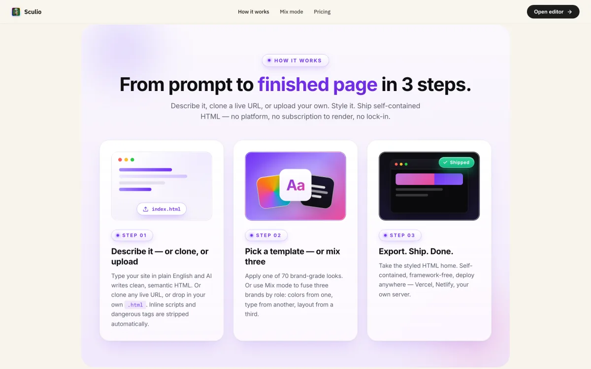
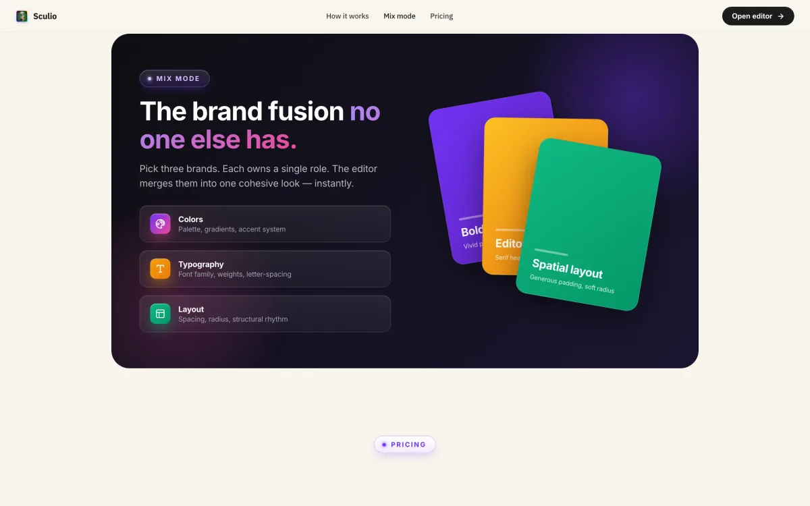
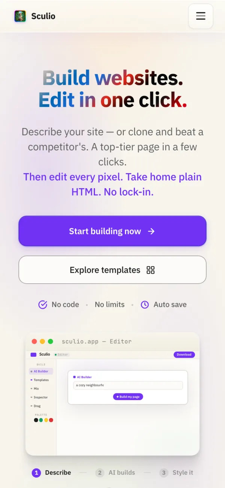

# Sculio

> **A visual HTML editor that runs in the browser: start from a prompt, a URL or an upload, edit the page, then download HTML or publish a static share link.**

**Live:** [editor-beta-ruby.vercel.app](https://editor-beta-ruby.vercel.app) - source is private; this repo is the write-up.

  

## Turning three entry doors into one editable canvas

An AI builder writes semantic HTML from a prompt, a URL clone pulls a live page in with its CSS, upload takes anything else. All three land on one canvas where text, fonts, colour, position and icons are editable. 70 brand templates repaint that same markup; Mix fuses three brands into one look.

One of 142 design-system brand voices is appended to the builder's system prompt, but voice tunes **copy only** - zero classes, ids or inline styles, so the skeleton survives repainting by any template.

## Resolving `@import` chains so a clone keeps its CSS

The clone enhancer inlines a page's stylesheets and wraps them in `@layer uploaded-css{}` so cloned CSS can't outrank the editor's own. Per spec `@import` is invalid inside a `@layer` block, so every `@import` a fetched sheet pulled in was **silently dropped by the browser** and sites that split CSS that way cloned unstyled.

The enhancer now resolves the chain itself: fetch each bare `@import` through the proxy chain, recurse, splice in place, bounded by 12 fetches per clone and a URL cache that breaks import cycles. Qualified `media`/`layer()`/`supports()` imports stay intact, a failed fetch leaves the `@import` alone rather than corrupting the sheet, and the result merges into the *stored* clone so a reload doesn't lose it.

## Accounts, drafts and static publishing

Cloudflare Workers and KV now hold account sessions, plans and the token wallet. The browser validates its account state through `/me`; cached local state cannot grant paid or administrator authority. Drafts are isolated by account, and the editor requires an account.

Publish, Update and Unpublish use a separate Worker origin. Shared pages are static: scripts are stripped, the response enforces `script-src 'none'`, and every page carries a Sculio badge and `noindex`. Updates and removal require the page's edit token.

The editor remains desktop-only at widths of 760px and below. General confirmation-email delivery still requires a verified sending domain; the current Resend sandbox limits email delivery.

## Gating paid API spend at the edge

The three paid routes - AI build, AI research and Analyze - sit behind a same-origin check plus a single-use Cloudflare Turnstile token verified server-side, fail-closed, since Origin alone is forgeable. Behind that, a non-forgeable HMAC entitlement token (`{sub, tier, tokens, exp}`, mintable only server-side) is wired into all three routes. Verification follows its signing-secret and enforcement configuration; the paid billing and entitlement-issuance path remains incomplete. Client-supplied plan names do not constitute authorization.

Scraping runs behind a self-hosted proxy Worker with KV rate caps. The analyze scraper's direct fetch walks redirects manually, three hops at most, revalidating each hop against the SSRF allowlist, since `redirect: 'follow'` chases a 30x to a link-local address blind; the clone proxy Worker's source carries the same walk.

## Isolating a competitor-analysis report inside the editor

Analyze is a framework-free engine of pure ES modules on Vercel Node routes: no persistence, no paid keys by default, company facts from Wikidata, GLEIF, SEC and RDAP. Its charts are all inline SVG (138 in the sample report, a 5-axis radar, box plots) and the report mounts in a **shadow root** with its own stylesheets, so it and the editor's CSS can't reach each other.

## Verifying past an anti-clone wipe with curl and a seeded Playwright session

The landing page runs an anti-clone script that blanks the DOM under automation - which also blanks your own headless QA. Verification splits: `curl` for headers, endpoint gates and served bundles; an admin-seeded Playwright session for the editor interior, since the wipe only covers the landing surface, never the editor view. Compositor animations don't tick under Chrome's `--virtual-time-budget`, so the hero demo's beats were checked by seeking with negative `animation-delay` per frame. On **2026-09-07**, `npm test` passed 722 unit cases. A read-only Chromium visit loaded the live landing page without page errors or failed requests; authenticated editing, publishing and email delivery were not re-run in this documentation pass.

## Stack

`vanilla JS` `CSS` `HTML`, no framework. Vercel serverless routes under `api/`; Node for tests. Six self-hosted Cloudflare Workers: account authority, static publishing, URL proxy with KV rate caps, Turnstile verification, AI builder and transactional email. Vercel routes connect the browser to the service layer.

RTL is supported. Paid API entitlement enforcement remains deferred until its signing and billing path is provisioned. KV rate and wallet counters are not hard guarantees under concurrent requests.

## Screenshots

  

  

  

Source is private. Built by [@shear559](https://github.com/shear559).
